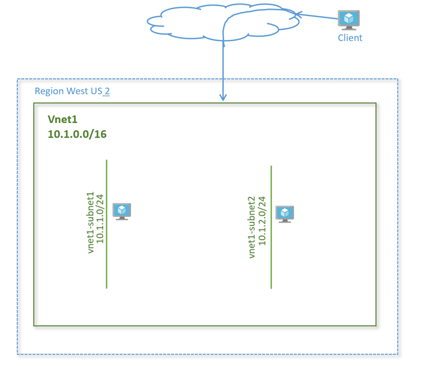
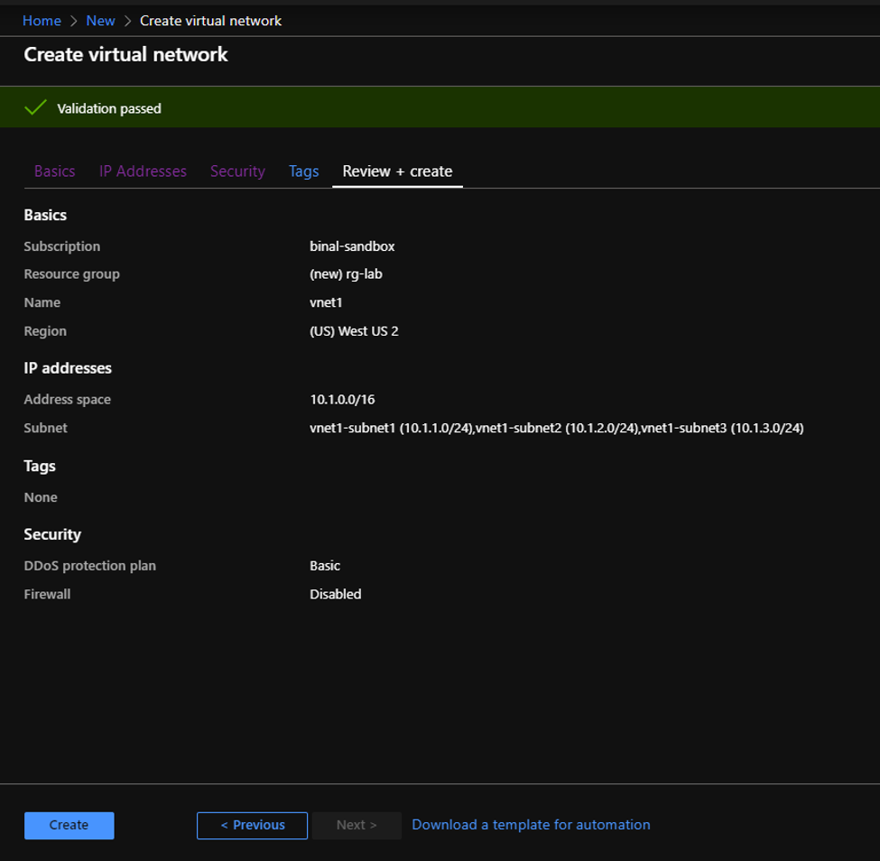
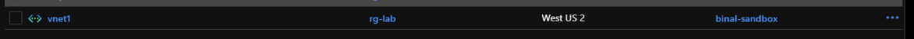
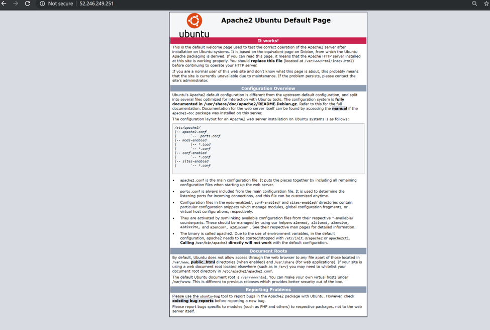

# Networking Lab 1 - Create a Virtual Network

## Lab Overview

In this lab, we will learn how to get started with on Azure to deploy your IaaS resources. We will create a virtual network (vNet) in Azure. We will then add two subnets in the lab and add two virtual machines, one in each subnet.

It is expected you have access to Azure portal and have an account and subscription created on Azure.

## Lab Diagram



## Create a virtual network

1. To access the Azure portal, go to <http://portal.azure.com>
1. Click on **Create a resource** > **Networking** > **Virtual Network**
1. In **Create virtual network**, enter or select this information:

    **Setting** | **Value**
    ---: | ---
    Subscription | Select your subscription
    Resource group | Select **Create new**, enter _rg-lab_, then select **OK**
    Name | Enter _vnet1_
    Region | Select (US) **West US 2**

1. Click **Next: IP Addresses**

    **Setting** | **Value**
    ---: | ---
    IPv4 address space | Enter _10.1.0.0/16_

1. Click **+Add subnet**

    **Setting** | **Value**
    ---: | ---
    Subnet-name | Enter _vnet1-subnet1_
    Subnet - Address range | Enter _10.1.1.0/24_

1. Click **Add**
1. Repeat steps 4 and 5 to add one more subnet as below:

    **Setting** | **Value**
    ---: | ---
    Subnet-name | Enter _vnet1-subnet2_
    Subnet - Address range | Enter _10.1.2.0/24_

1. Leave the rest as default and select **Review + Create**. Review the values. Your output should look like this:

    

1. Click **Create**
1. Once the deployment is complete, go to the search bar at the top and type ‘Virtual Networks’ (`G`+`/`). Select **Virtual Networks** in the search results. You should see vnet1 show up in the list.

    

## Create virtual machines

Create a virtual machine in the virtual network.

## Create the first VM

1. On the upper-left side of the screen, select **Create a resource** > **Compute** > **Virtual Machine**
1. In **Create a virtual machine - Basics**, enter or select this information:

    **PROJECT DETAILS**

    **Setting** | **Value**
    ---: | ---
    Subscription | Select your subscription.
    Resource group | Select **rg-lab**. You created this in the previous section.

    **INSTANCE DETAILS**

    **Setting** | **Value**
    ---: | ---
    Virtual machine name | Enter _vnet1-vm-mgmt1_
    Region | Select **West US 2**
    Availability options | Leave the default **No infrastructure redundancy required**
    Image | Leave the default **Ubuntu Server 18.04 LTS**
    Size | Leave the default **Standard DS2 v3**

    **ADMINISTRATOR ACCOUNT**

    **Setting** | **Value**
    ---: | ---
    Username | Enter a user name of your choosing
    Password | Enter a password of your choosing. The password must be at least 12 characters long and meet the [defined complexity requirements](https://docs.microsoft.com/en-us/azure/virtual-machines/windows/faq?toc=%2fazure%2fvirtual-network%2ftoc.json#what-are-the-password-requirements-when-creating-a-vm).
    Confirm Password | Reenter password

    **INBOUND PORT RULES**

    **Setting** | **Value**
    ---: | ---
    Public inbound ports | **None**

1. Select **Next : Disks**
1. In **Create a virtual machine - Disks**, leave the defaults and select **Next : Networking**
1. In **Create a virtual machine - Networking**, select this information:

    **Setting** | **Value**
    ---: | ---
    Virtual network | Leave the default **vnet1**
    Subnet | Leave the default **vnet1-subnet1 (10.1.1.0/24)**
    Public IP | Leave the default **(new) vnet1-vm-mgmt1-ip**
    Public inbound ports | Select **Allow selected ports**
    Select inbound ports | Select **HTTP** and **SSH**

1. Select **Review + create**. You're taken to the **Review + create** page where Azure validates your configuration.
1. When you see the **Validation passed** message, select **Create**.
1. Once the deployment is complete, click **Go to resource**. This will take you to the VM overview page. Verify the VM status shows as **Running**.

## Create a second virtual machine

Repeat the above steps to spin up a second virtual machine with the following configuration:

**Setting** | **Value**
---: | ---
Instance name | _vnet1-vm-web1_
Subnet | _vnet1_
Subnet | _vnet1-subnet2_
Public Inbound ports | _SSH, HTTP_

Keep the rest of the parameters default and create the virtual machine.

## Install web server on virtual machine vnet1-vm-web1

Connect to the virtual machine.

1. Search virtual machines in the **Search** bar in the portal
1. Select the virtual machine **vnet1-vm-web1**
1. Go to the **Overview** page
1. Copy the public IP address of the VM
1. From your laptop terminal, run command:

    ```bash
    ssh <username>@<Public_IP_of_the_VM>
    ```

1. Install apache2 on the server

    ```bash
    sudo apt-get -y update
    sudo apt-get -y install apache2
    ```

1. Verify the service is running on the server. You should see a status of active (running) in the output:

    ```bash
    sudo service apache2 status
    ```

1. When done, type `exit` to leave the SSH session.

## View the web server in action

Use a web browser of your choice to view the default welcome page. Type the public IP address of the VM as the web address. The public IP address can be found on the VM overview page or as part of the SSH connection string you used earlier.

Verify the web page loads successfully.



## Next

In the next lab we will create Network Security Groups to control traffic via layer 4 ACLs.

**◄** | **▲** | **►**
--- | :---: | ---:
_N/A_ | [README](./README.md) | [Lab 2: NSGs](./02-Network-Security-Groups.md)
