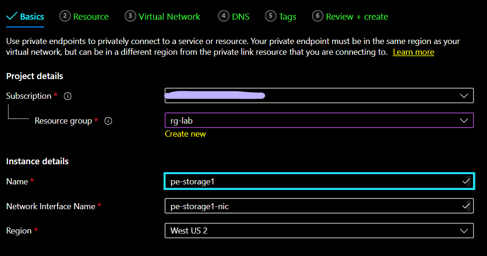
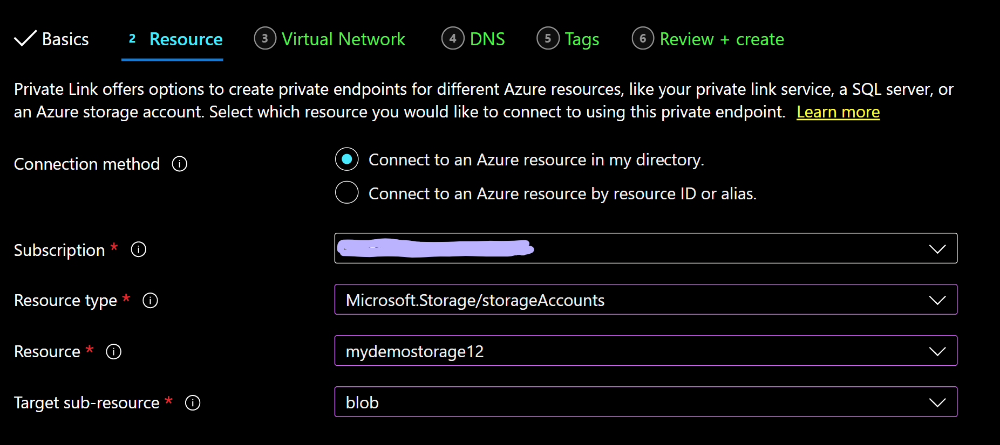
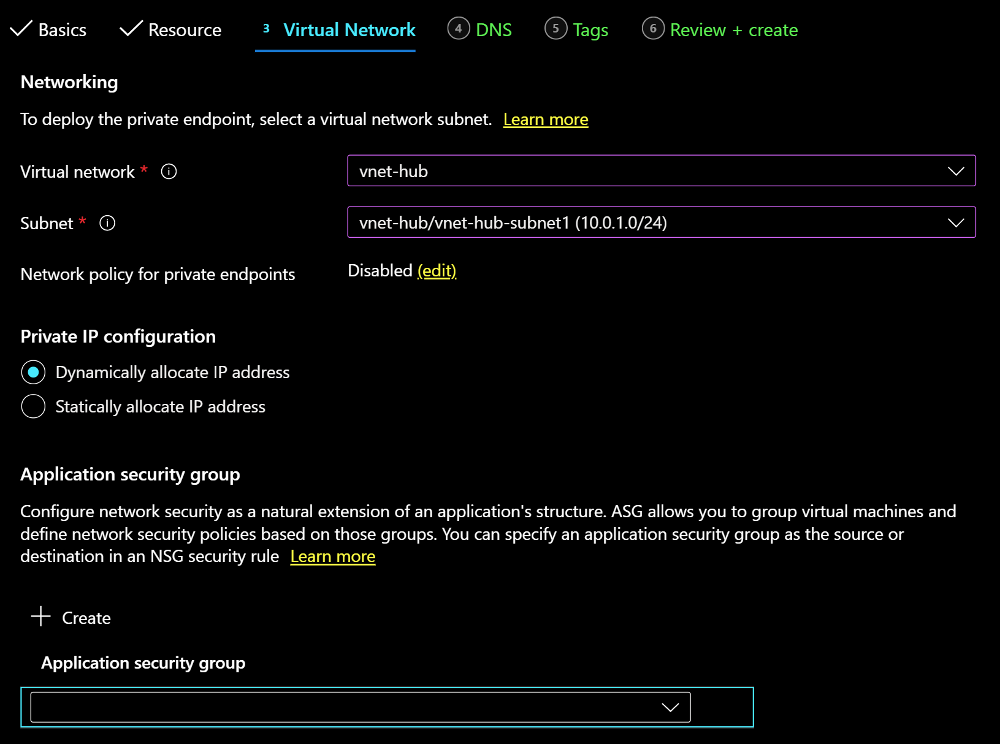
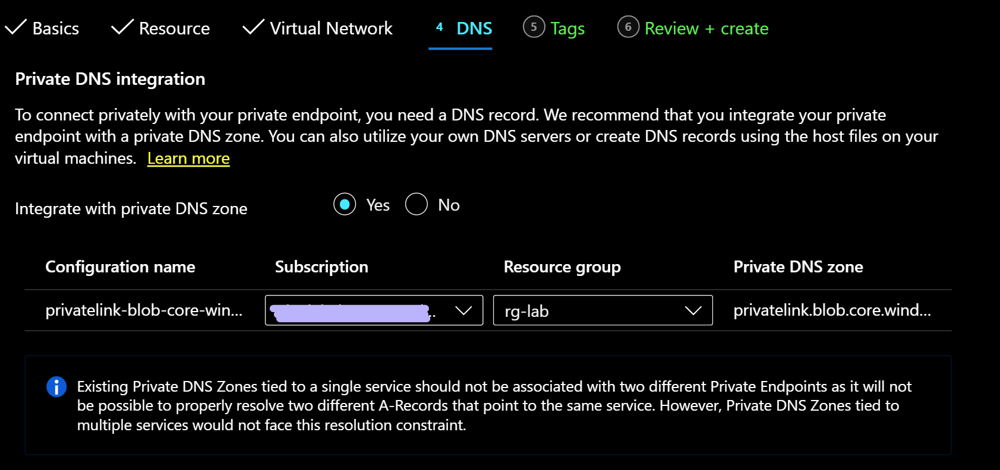
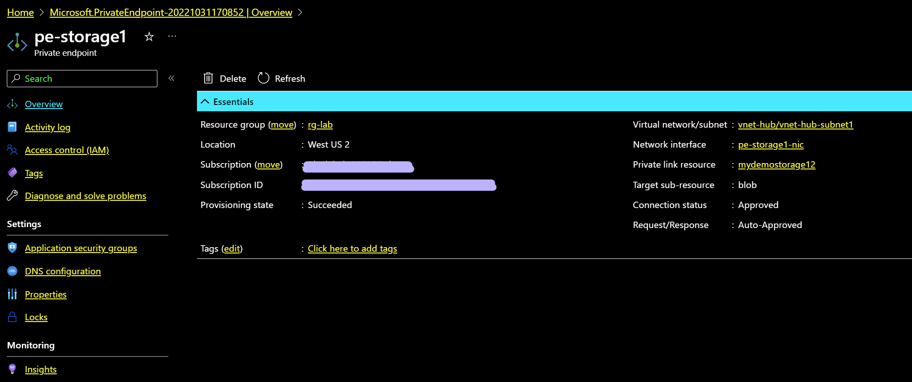
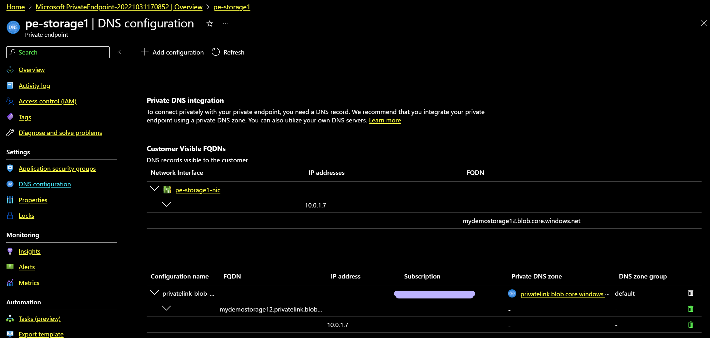
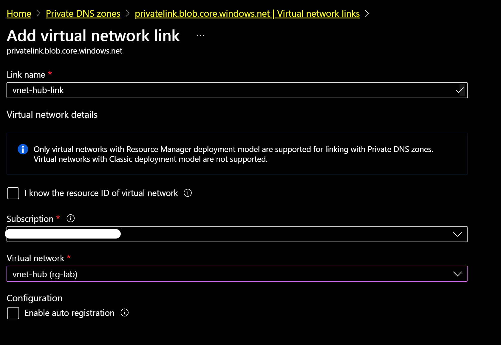
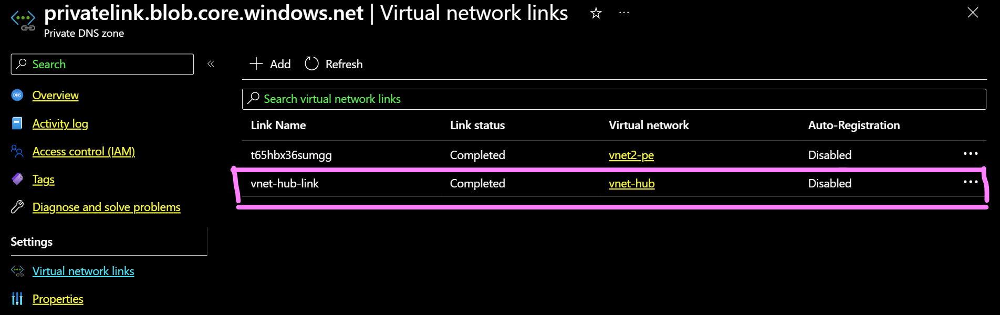
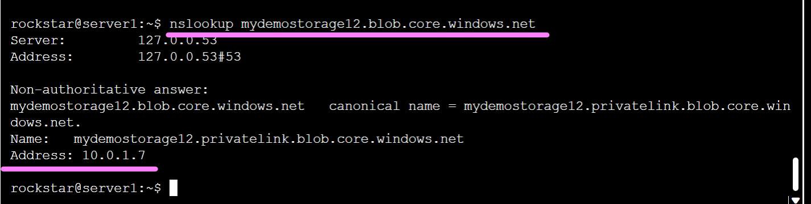
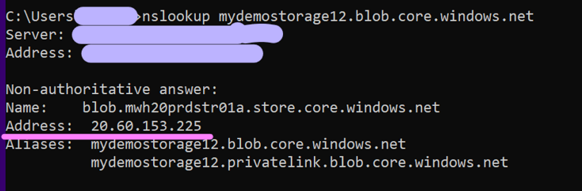

## Azure Private Link\: Private Endpoint - Access your PaaS services privately

Azure Private Link enables you to access your Azure PaaS resources privately. It enables you to creates a private endpoint for your service. This private endpoint is a network interface created in your virtual network that gets an IP address from the virtual network range. When a resource from this virtual network, or connected to this virtual network, accesses the service, the service resolves to this private IP of the resource, making the communication completely private. 

The lab below walks you through the steps to create a private endpoint to an existing storage account. You can replicate these steps for any supported PaaS services that you have deployed. The lab assumes you have a storage account pre-created.

To create a private endpoint for your storage:
	1. Log in to your Azure portal and search for Private Link.
	2. From there, click on 'Create private endpoint'.
	3. Provide the name and region for the private endpoint.
	

 

On the next Resources tab, select the resource type as Microsoft.Storage/storageAccounts. An easier way is to  search for 'storage' in this field and it will show you the option in the dropdown. Next, select your storage account and select blob as the target sub-resource.

Next, you need to select a virtual network and a subnet where the private endpoint will reside. Notice on this screen that you have the option to statically assign a private IP if you wish. You can also create an application security group to restrict traffic to this private endpoint. For this lab, we will leave the defaults and add the virtual network and subnet details.

Next, we configure private DNS zone, Select yes to integrate with private DNS zone. This will create a private DNS zone for the private endpoint as you see below.

Once you complete these steps, a private endpoint will be configured in your virtual network for the storage account. Go to the resource once it is deployed and look through the details of your private endpoint on the Overview page. 

Now go to the DNS Configuration of the private endpoint. You see that the private endpoint has a network interface created. It has a private IP address assigned from the subnet that I provided and it maps to the FQDN name of the storage account. The private DNS zone is also successfully configured for this private endpoint.

Once we have the private dns zone configured, make sure the virtual network is linked to the private dns zone. 
To create the virtual network link, go to the Private DNS Zone page and load the private DNS zone for the private endpoint which should show as  privatelink.blob.core.windows.net.

Next, go to Virtual Network Link and add a link for your virtual network.

You should now see a virtual network link created.

To test the private link, login to the console of a virtual machine in the virtual network and lookup the IP for your storage account. You can find the storage account FQDN name under the DNS configuration tab of the private endpoint. In my case, my storage account is  mydemostorage12.blob.core.windows.net

As you see above, the storage domain name resolved to its private endpoint IP 10.0.1.7.

If you repeat the same steps from your laptop, this will resolve to the storage service's public IP address.

We just enabled private access to our storage account using Azure Private Link.
